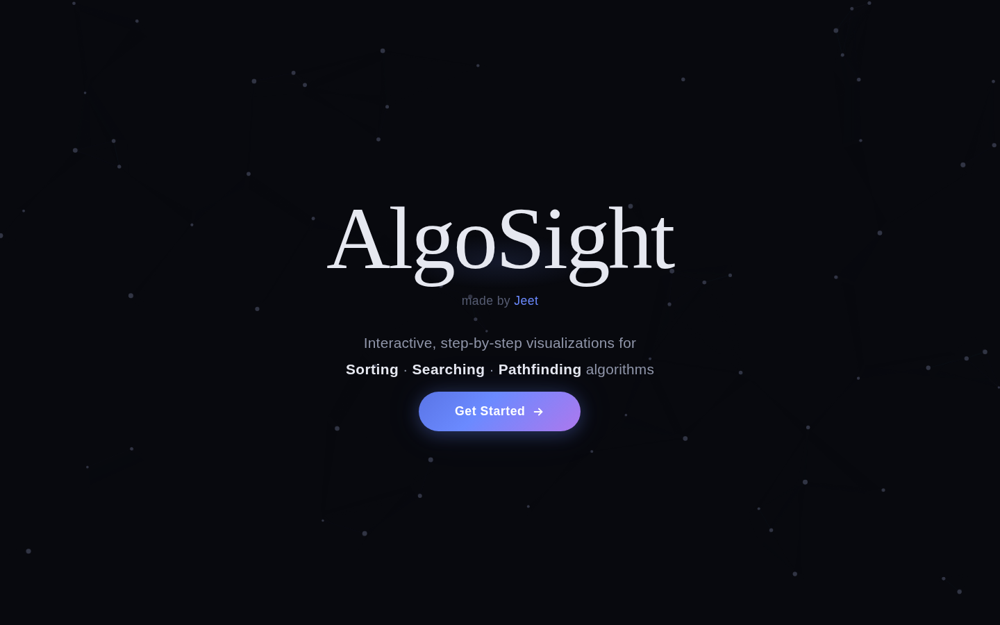
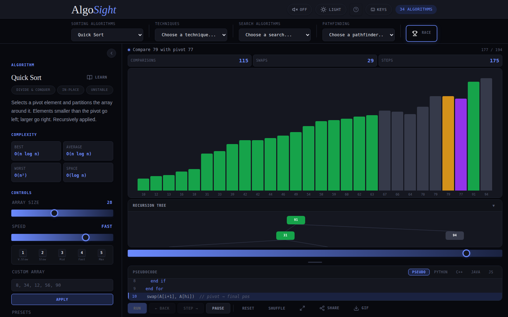
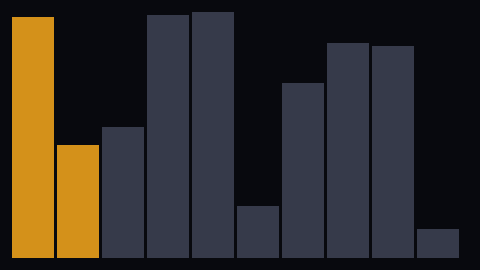
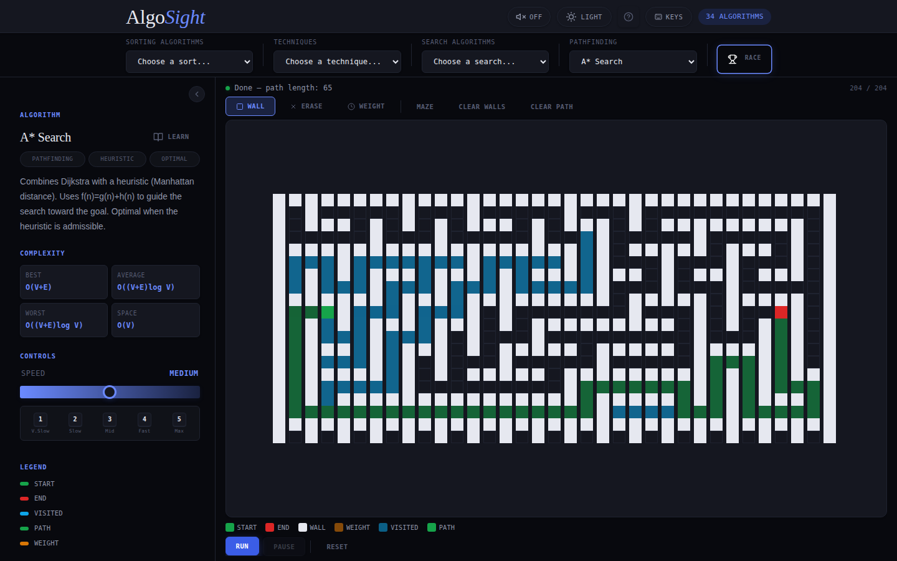
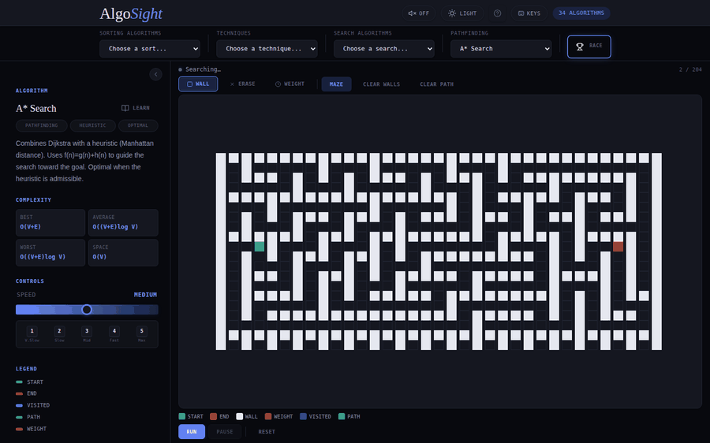
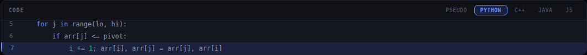
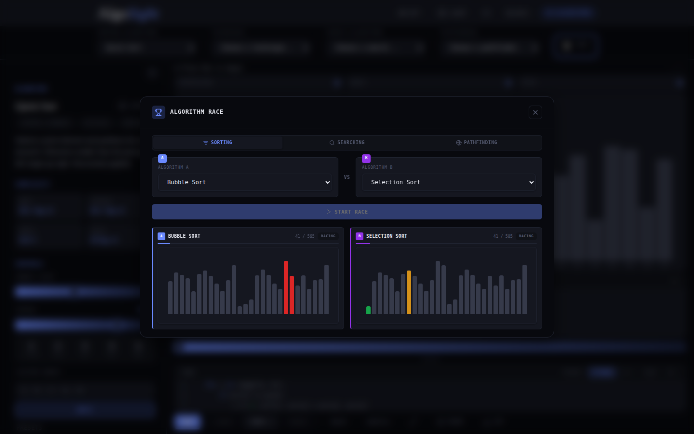

# AlgoSight https://algo-sight.netlify.app/#app

AlgoSight is an interactive playground for learning algorithms. Instead of reading pseudocode and imagining what happens, you get to watch it happen: bars swap, pointers move, grids light up, and the matching code line highlights as each step runs.

It covers 34 algorithms across sorting, common interview techniques, searching, and pathfinding, all in a single-page app with no build step or backend required.

## Screenshots

**Landing page**


**Sorting visualization**


Running Bubble Sort on a shuffled array:



**Pathfinding grid**


And A* Search solving a generated maze from start to finish:



**Code panel with synced highlighting**


**Algorithm race mode**


## Features

- **34 algorithms in one place**, organized into four categories: sorting, techniques, searching, and pathfinding.
- **Step-by-step execution** with play, pause, step forward, step back, and a scrubbable timeline slider, so you can move through an algorithm at your own pace.
- **Code panel synced to the visualization**, showing Pseudocode, Python, C++, Java, or JS, with the active line highlighted as the algorithm runs.
- **Race mode**, where you can pit two algorithms against each other on the same input and watch which one finishes first.
- **Narration mode** that explains, in plain language, why each step is happening.
- **Custom input controls**: set your own array, pick a search target, adjust window size, or load a best/average/worst-case preset.
- **Pathfinding grid** with wall drawing, weighted cells, and a maze generator, so you can build your own mazes and compare BFS, DFS, Dijkstra, and A*.
- **Recursion tree view** for divide-and-conquer algorithms like merge sort and quick sort.
- **GIF export and shareable links**, so you can save a run or send someone a link to what you're looking at.
- **Sound and dark/light themes**, plus a full set of keyboard shortcuts for anyone who prefers not to reach for the mouse.
- **Collapsible side panel**, so you can hide the algorithm description and give the visualization and code more room.
- **Guided tutorial** for first-time visitors.

## Supported algorithms

**Sorting**
Bubble Sort, Selection Sort, Insertion Sort, Merge Sort, Quick Sort, Counting Sort, Heap Sort, Radix Sort, Shell Sort, Cocktail Shaker Sort, Comb Sort, Gnome Sort, Bucket Sort, Tim Sort, Pigeonhole Sort

**Techniques**
Two Pointers, Sliding Window, Kadane's Algorithm, Prefix Sum, Frequency Counter, Dutch National Flag, Boyer-Moore Majority Vote, Merge Intervals, Reservoir Sampling

**Searching**
Linear Search, Binary Search, Jump Search, Interpolation Search, Exponential Search, Ternary Search

**Pathfinding**
Breadth-First Search, Depth-First Search, Dijkstra's Algorithm, A* Search

## Getting started

AlgoSight is a static site: just HTML, CSS, and vanilla JavaScript. There's nothing to install and no dependencies to pull in.

1. Clone or download the repository.
2. Open `index.html` directly in your browser, or serve the folder locally so fonts and any future assets load correctly:

   ```bash
   # using Python
   python3 -m http.server 8000

   # or using Node
   npx serve .
   ```

3. Visit `http://localhost:8000` and click "Get Started."

That's it. There's no build process, no package.json, and no configuration to set up.

## Usage

- Pick an algorithm from the top navigation bar (Sorting, Techniques, Search, or Pathfinding).
- Use **Run** to play the whole animation, or **Step** to move through it one action at a time.
- Adjust **Array Size** and **Speed** from the sidebar, or type in a custom array.
- Try a **preset** (best, average, worst, or edge case) to see how an algorithm behaves under different inputs.
- Switch to **Race** mode from the top bar to compare two algorithms side by side.
- Click the arrow icon at the top of the sidebar to hide it and give the visualization more space.

### Keyboard shortcuts

| Key | Action |
|-----|--------|
| `Space` | Run or pause |
| `→` | Step forward |
| `←` | Step back |
| `R` | Reset |
| `S` | Shuffle array |
| `F` | Toggle fullscreen |
| `L` | Toggle narration mode |
| `1`-`5` | Set speed (very slow to instant) |
| `W` | Wall tool (pathfinding grid) |
| `E` | Erase tool (pathfinding grid) |
| `G` | Weight tool (pathfinding grid) |

## Project structure

```
.
├── index.html      # Markup and layout
├── style.css       # Styling, themes, and responsive rules
├── script.js       # Algorithm logic, rendering, and interactivity
├── LICENSE
└── README.md
```

## Tech stack

Plain HTML, CSS, and JavaScript. No frameworks, no bundler, no build step. Fonts are loaded from Google Fonts (Inter, JetBrains Mono, and Instrument Serif).

## Contributing

Bug reports, algorithm suggestions, and pull requests are welcome. If you're adding a new algorithm, try to follow the existing pattern in `script.js` (a step generator plus an entry in the metadata object) so it plugs into the visualization, code panel, and controls automatically.

## License

This project is licensed under the MIT License. See [LICENSE](LICENSE) for the full text.

## Author

Made by [Jeet](https://github.com/jeet-43)
